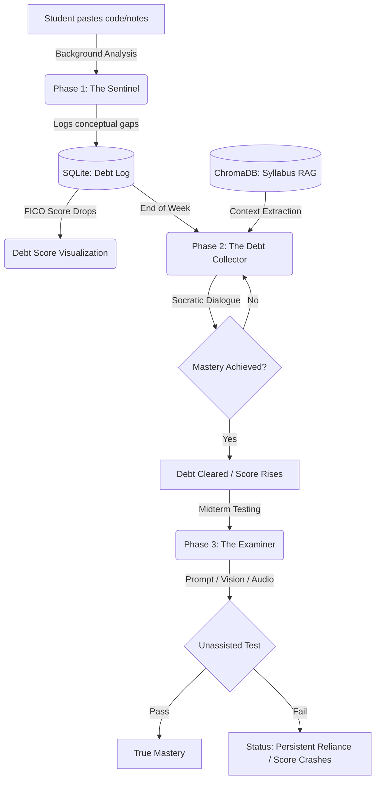

# 🧠 Comprehension Debt Tracker (CDT)

> Ask question → get answer? **No.** <br>
> Track understanding → enforce learning → verify mastery. **Yes.**

The **Comprehension Debt Tracker (CDT)** is a structured behavioral intelligence ecosystem built entirely on localized AI. It forces students to confront their **AI over-reliance** by measuring what they passively "borrow" (copy/paste) and making them pay it back through rigorous, multi-modal Socratic clearance. 

---

## 🔥 Why This Matters (The Real Problem)
Generative AI has radically shifted modern education from *critical reasoning* to *passive reliance*. Students frequently copy and paste architectural patterns or equations they don't fully understand. CDT introduces the concept of a **Learning Debt Score** (similar to a FICO credit score) that actively drops when a student cuts corners, solving the systemic over-reliance problem using the very AI tools that created it.

---

## 🏗️ System Architecture (Full Pipeline)

CDT is not a singular chatbot. It is a rigorous **end-to-end learning verification system**:



---

## 🧠 Why strictly Gemma?

This architecture was purpose-built exclusively around the **Gemma-4** ecosystem for maximum efficacy and student privacy:
- **Zero Privacy Leakage:** Because CDT intercepts all a student's personal notes and keystrokes, utilizing Cloud APIs is unethical. Gemma runs **locally offline via Ollama**, guaranteeing total privacy.
- `gemma-4-E2B` (The Tracking Agent): Lightweight and hyper-fast, operating quietly in the background (The Sentinel) using **native function calling** to extract precise concepts without stalling the student's workflow.
- `gemma-4-E4B` (The Socratic / Multimodal Examiner): Leveraged for deep, robust reasoning logic during RAG context injection, and its incredible **Vision / Audio Multimodality** to parse handwritten exams inside the Sanctuary.

---

## 🚀 The Three Phases

### 🛡️ Phase 1: **The Sentinel** (Passive Tracking)
A Streamlit sidebar observer with a real-time **FICO Learning Score**. As you paste concepts you don't grasp, your score tanks in real-time, mapping precisely what knowledge you lack.

### 🕵️‍♂️ Phase 2: **The Debt Collector** (Active Clearing)
An offline Socratic clearance agent grounded completely in your local syllabus via ChromaDB. It refuses to hand out answers, dynamically navigating the student to independent realization before restoring their score.

### 👁️ Phase 3: **The Examiner** (Multimodal Verification)
Testing genuine mastery via an offline "Sanctuary" environment:
- **Vision Integration**: Aim your webcam at handwritten work. The model identifies where your logic fails and overlays a red bounding box.
- **Relapse Trigger**: Evaluates independent explanations without AI-assist. If the student fails a concept they supposedly "cleared", they are strictly flagged for **Persistent Reliance**.

---

## 🎥 Demonstration
*(Embed your 2-3 minute YouTube / GIF demonstration here! Show the Sentinel extracting code, the Collector guiding logic, and the Examiner Vision Box in action!)*

---

## 💻 Quick Start

### 1. Prerequisites
Pull the Gemma ecosystem locally via Ollama:
```bash
ollama run gemma-4-E2B
ollama run gemma-4-E4B
```

Install the required environment:
```bash
git clone https://github.com/Charan-suresh/CDT.git
cd CDT
pip3 install streamlit ollama chromadb pdfplumber pillow
```

### 2. Run the Local Framework ⚙️
Be sure to spin up the background Ollama daemon (`ollama serve`) first in terminal 1.

Then load your syllabus (Terminal 2):
```bash
python3 vectorize.py ./Dsa.pdf
```

Spin up the phases (Terminal 3):
- **Sentinel**: `python3 -m streamlit run sentinel.py`
- **Debt Collector**: `python3 -m streamlit run debt_collector.py`
- **Examiner**: `python3 -m streamlit run examiner.py`
