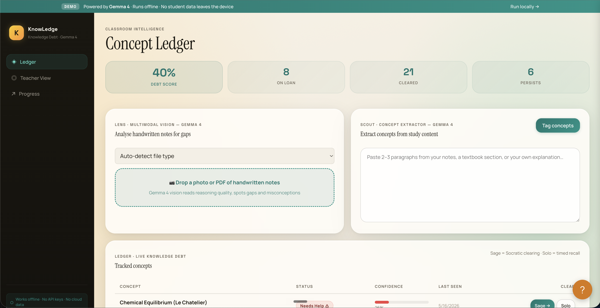

# KnowLedge
### *Turn borrowed understanding into permanent mastery.*

**Every student deserves a personal Socratic tutor — not just those who can afford one.**



---

## The Problem

Students worldwide face the same invisible crisis: **learning debt**.

When a student copies a definition they don't understand, pastes an explanation they can't defend, or memorises a formula without knowing why it works — they accumulate conceptual debt. Each borrowed idea sits on top of the next. By exam time, the structure collapses.

Private tutors fix this by asking *"But why does that work?"* — the Socratic method. A tutor who keeps probing until the student can truly explain a concept from memory. But private tutors cost money. Most students don't have one.

**KnowLedge gives every student that tutor, powered entirely by Gemma 4, running offline on any laptop.**

---

## What KnowLedge Does

KnowLedge is a **local-first, privacy-preserving learning debt tracker**. It intercepts conceptual gaps before they compound, forcing genuine understanding rather than passive accumulation.

```
Student pastes study material
         ↓
   Scout tags concepts → logged to Ledger as "On Loan" (debt)
         ↓
   Sage runs Socratic clearing → clears concepts only after genuine explanation
         ↓
   Lens verifies handwritten work → flags gaps in reasoning
         ↓
   Solo runs timed recall test → confirms retention under pressure
         ↓
   Instructor sees only aggregate summaries → privacy preserved
```

---

## Gemma 4 Integration — Four Specialised Roles

This is not a chatbot wrapper. KnowLedge deploys Gemma 4 as **four distinct agents**, each with a tightly scoped system prompt and a different cognitive task:

| Role | Job | Gemma 4 Capability Used |
|------|-----|------------------------|
| 🔍 **Scout** | Extracts 3–8 key concepts from pasted study material and returns structured JSON | Instruction following, structured output |
| 🦉 **Sage** | Runs a full Socratic dialogue — never explains, only questions — until the student earns a `CLEARED` verdict | Multi-turn reasoning, pedagogical judgment |
| 📷 **Lens** | Analyses photos of handwritten notes and diagrams for gaps and misconceptions | **Multimodal vision** (Gemma 4's native image understanding) |
| ⏱ **Solo** | Scores a timed free-recall answer on accuracy and completeness, returns structured feedback JSON | Evaluation and grading reasoning |

Each role receives a different system prompt (see `knowledge/prompts.py`) and is stateless — Gemma 4 holds no session state between requests. The app orchestrates all state locally via SQLite.

### The Clearing Protocol

Sage sessions implement a genuine **Socratic clearing loop**:

1. Opens with a simple question about the concept
2. Escalates based on the student's answer quality
3. Uses "wrong trap" questions to probe for surface-level memorisation
4. Issues `{"verdict": "CLEARED", "confidence": 0.92}` only when 3+ genuine exchanges demonstrate mastery
5. Integrity checks (typing cadence, timing) flag copy-pasted responses

---

## Why This Matters — The Social Good Case

### Equity in Education
In most of the world, access to a Socratic tutor is a privilege of wealth. KnowLedge's offline-first design means it works in low-bandwidth environments, government schools, and anywhere without reliable internet. The entire AI pipeline runs on a mid-range laptop with `~3.2 GB` of disk space.

### Privacy by Design
Schools cannot share student data with cloud services in most jurisdictions. KnowLedge solves this at the architecture level:
- All student interactions stay on-device in a local SQLite database
- Instructor sync exports **only aggregate concept-level summaries** — never conversation transcripts
- No API keys, no cloud accounts required for full functionality

### Compounding Debt is a Crisis
A student who doesn't understand Newton's Second Law will fail thermodynamics two years later without ever knowing why. KnowLedge makes this invisible debt visible — in real time, per concept, with a quantified debt score — so students and teachers can intervene before it compounds.

---

## Architecture

```
┌─────────────────────────────────────────────────────────────┐
│                        Browser (Jinja2)                      │
│  /ledger   /progress   /reports   /help                      │
└────────────────────┬────────────────────────────────────────┘
                     │ HTTP
┌────────────────────▼────────────────────────────────────────┐
│                  FastAPI (knowledge/main.py)                  │
│                                                              │
│  ┌──────────┐  ┌──────────┐  ┌──────────┐  ┌────────────┐  │
│  │  Scout   │  │   Sage   │  │   Lens   │  │    Solo    │  │
│  │ /extract │  │  /chat   │  │ /analyse │  │  /assess   │  │
│  └────┬─────┘  └────┬─────┘  └────┬─────┘  └─────┬──────┘  │
│       └─────────────┴─────────────┴───────────────┘         │
│                           │                                  │
│              ┌────────────▼───────────┐                      │
│              │   ollama_client.py     │                      │
│              │   (or HF Space proxy)  │                      │
│              └────────────┬───────────┘                      │
└───────────────────────────┼─────────────────────────────────┘
                            │
              ┌─────────────▼──────────────┐
              │  Gemma 4 E4B (unsloth/     │
              │  gemma-4-4b-it)            │
              │  Ollama local or HF Space  │
              └────────────────────────────┘

Local Storage:
  knowledge.db     ← SQLite: concepts, sessions, clearing history
  chroma_store/    ← ChromaDB: curriculum RAG context
```

**Key design decisions:**
- **Model fallback chain**: `gemma4:e4b → gemma3:4b → gemma3:1b` — always works even on minimal hardware
- **Role-switching via system prompts**: one model, four behaviours — no separate model weights
- **Stateless Gemma calls**: all session state lives in SQLite, making the AI layer trivially replaceable
- **RAG for curriculum context**: `knowledge/vectorize.py` lets teachers load course PDFs; Sage uses retrieval to stay on-curriculum

---

## Repository Structure

```
KnowLedge/
├── knowledge/              # FastAPI backend
│   ├── main.py             # Routes: ledger, progress, scout, sage, lens, solo
│   ├── prompts.py          # System prompts for all four Gemma 4 roles
│   ├── ollama_client.py    # Gemma 4 inference client (Ollama + HF Space)
│   ├── sage.py             # Socratic clearing loop + verdict detection
│   ├── lens.py             # Multimodal handwriting analysis
│   ├── scout.py            # Concept extraction
│   ├── integrity/          # Anti-spoof: cadence, timing, fingerprint checks
│   ├── sync/               # Privacy-preserving instructor sync
│   ├── rag.py              # ChromaDB retrieval for curriculum context
│   └── templates/          # Jinja2 HTML templates
├── cloud-run/              # Google Cloud Run deployment scripts
├── hf_space/               # Hugging Face Space config
├── scripts/                # Deployment verification tools
└── requirements.txt        # Python dependencies
```

---

## Core Workflows

**1. Scout — Extract concepts from study material**
- Go to `/ledger`
- Paste any paragraph of textbook content into the Scout panel
- Click "Tag concepts" — Gemma 4 extracts key noun phrases as a JSON array
- Concepts appear in the Ledger table with status "On Loan"

**2. Sage — Socratic clearing session**
- Click "Clear" next to any concept in the Ledger
- Sage opens with a probing question — answer it
- Keep answering until Sage issues a CLEARED verdict
- Try pasting a textbook definition verbatim — Sage will probe deeper

**3. Lens — Handwritten work verification**
- Go to the Lens panel on `/ledger`
- Drop a photo of handwritten notes (a phone photo works perfectly)
- Gemma 4 identifies which tracked concepts are present and flags gaps

**4. Solo — Timed recall test**
- Click "Solo" next to a cleared concept
- A 70-second timer starts — explain the concept from memory
- Gemma 4 scores accuracy and completeness

**5. Progress — Learning debt over time**
- Visit `/progress` to see debt score, clearing streak, and concept confidence breakdown

---

## Integrity and Anti-Gaming

KnowLedge includes a layered anti-spoof system in `knowledge/integrity/`:

- **Typing cadence analysis** — detects copy-paste events during Sage sessions
- **Session timing** — flags implausibly fast "clearing" submissions
- **Session fingerprinting** — links clearing records to a consistent device identity
- **Sage wrong-trap questions** — Sage deliberately inserts plausible misconceptions to test for surface-level parroting

None of this data leaves the device.

---

## Privacy-Preserving Instructor Sync

Teachers need class-level visibility without reading student conversations. The sync module (`knowledge/sync/`) exports:

```json
{
  "class_id": "physics-11b",
  "period": "2026-W19",
  "concept_debt_summary": {
    "Newton's Third Law": { "debt_rate": 0.62, "avg_clears": 2.1 },
    "Conservation of Momentum": { "debt_rate": 0.41, "avg_clears": 1.4 }
  }
}
```

Individual student names, conversation transcripts, and session content are never included. Sync only runs over Wi-Fi by default.

---

## What Makes This Different

| Typical AI Study Tool | KnowLedge |
|----------------------|-----------|
| Gives students answers | Forces students to find answers themselves |
| Cloud-only, requires accounts | Offline-first, zero accounts needed |
| Shares conversation data | Shares only anonymous aggregates |
| Single-mode text interface | Multimodal: text + handwritten image analysis |
| No integrity verification | Anti-spoof, cadence analysis, session fingerprinting |
| One AI role (Q&A) | Four distinct AI roles with tightly scoped prompts |

---

## Running Offline Locally

KnowLedge is designed to run completely offline, preserving privacy and working without any internet connection. Here is how to set it up:

1. **Clone the repository:**
   ```bash
   git clone https://github.com/Charan-suresh/KnowLedge.git
   cd KnowLedge
   ```

2. **Install dependencies:**
   ```bash
   pip install -r requirements.txt
   ```

3. **Install Ollama and pull the Gemma 4 model:**
   - Download Ollama from [ollama.com](https://ollama.com)
   - Pull the model (requires ~3.2 GB):
     ```bash
     ollama pull gemma4:e4b
     ```

4. **Start the Ollama server (in a separate terminal):**
   ```bash
   ollama serve
   ```

5. **Start the KnowLedge app:**
   ```bash
   uvicorn knowledge.main:app --reload
   ```

6. Open your browser and navigate to `http://127.0.0.1:8000/ledger`.


## License

Apache License 2.0 — see [LICENSE](LICENSE) for details.

---

<div align="center">

*Built with Gemma 4 · For students everywhere who learn alone.*

</div>
